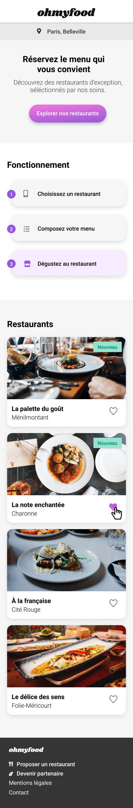

# Projet OhMyFood

### Description

Le projet Ohmyfood! vise à créer un site web 100% mobile qui répertorie les menus de restaurants gastronomiques et permet aux utilisateurs de composer leurs menus personnalisés, réduisant ainsi le temps d'attente dans les restaurants en évitant de consulter la carte sur place.

### Documentation technique

Pour plus de détails sur les spécifications techniques et les contraintes du projet, [cliquez ici](doc/doc-p3.pdf).

### Technologies utilisées

- HTML : Pour la structure de la page web.
- CSS/SCSS/SASS : Stylisation et design du site.
- Design Responsive : Adaptatif pour mobiles, tablettes et desktop.
- Compatibilité Navigateur : Testé et optimisé pour Chrome et Firefox.
- Validation W3C : Code conforme aux standards.
- Animations : Effets visuels réalisés avec CSS/SASS.

### Installation

Clonez le dépôt et ouvrez le fichier index.html dans votre navigateur
